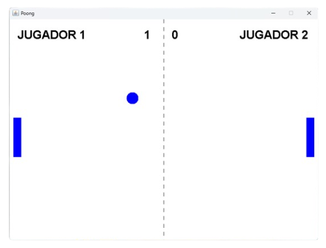
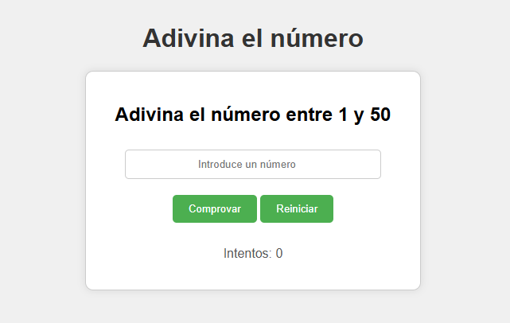
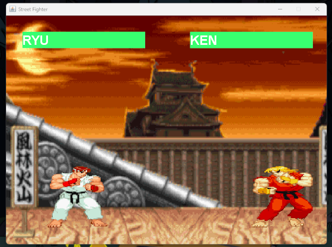
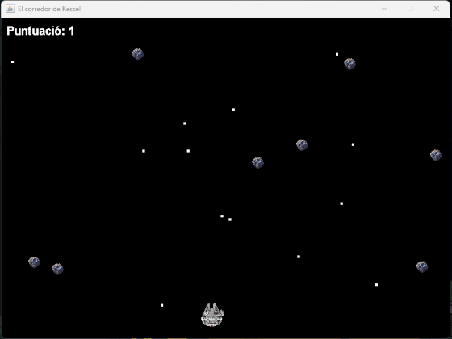
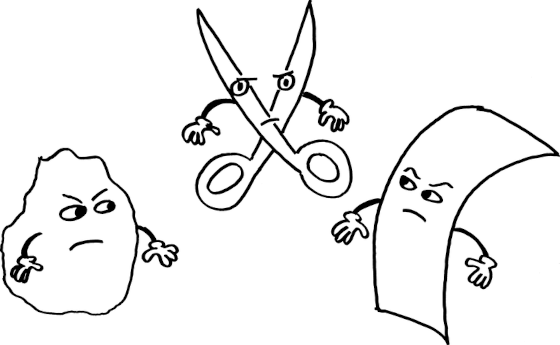

# Juegos en Diferentes Lenguajes de Programación 🎮

Este repositorio contiene una colección de juegos en varios lenguajes de programación

## [Pong](./poong) (Java) 🏓

**Poong** es una versión simple del famoso juego **Pong**, en el que dos jugadores controlan palas para evitar que una pelota pase por su lado de la pantalla

  

## [Adivina el Número](./adivina) (HTML, CSS, JavaScript) 🔢 

**Adivina el Número** es un juego en el que el jugador debe adivinar un número aleatorio dentro de un rango determinado

  

## [Street Fighter Lite](./streetFighterLite) (Java Swing) 🥊

**StreetFighterLite** es una versión simplificada del clásico juego de lucha **Street Fighter**, desarrollada en **Java** usando **Swing** y **Graphics**

  

## [El Corredor de Kessel](./esquivaAsteroides) (Java Swing) 🚀

**El Corredor de Kessel** es un juego arcade en el que controlas una nave espacial que viaja a toda velocidad, tu objetivo es esquivar el mayor número de asteroides para conseguir la máxima puntuación

  

## [Piedra, papel o tijera](./piedra_pape_tijera) (Java ) 🪨🧻✂️

**Piedra, Papel o Tijera** es un juego de consola desarrollado en Java donde el jugador compite contra el ordenador.  
El objetivo es elegir una opción entre piedra, papel o tijera y vencer a la elección aleatoria del ordenador, siguiendo las reglas clásicas del juego.

  

